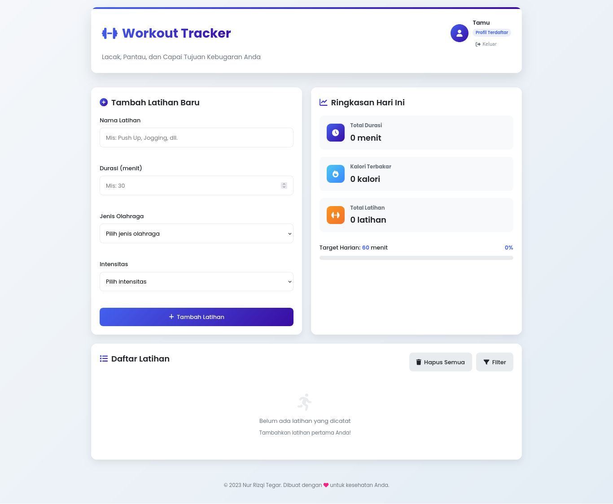

#JUDUL PROJECT
 Workout Tracker - Aplikasi Pelacak Latihan Kebugaran   

#DESKRIPSI SINGKAT
 Workout Tracker adalah aplikasi web progresif yang dirancang untuk membantu pengguna dalam memantau dan mengelola aktivitas kebugaran mereka sehari-hari. Aplikasi ini menyediakan antarmuka yang intuitif dan mudah digunakan untuk mencatat berbagai jenis latihan, melacak durasi, serta memperkirakan kalori yang terbakar selama sesi olahraga. Dengan fitur-fitur seperti filter berdasarkan jenis olahraga dan intensitas, pengguna dapat dengan mudah mengorganisir dan menganalisis rutinitas kebugaran mereka.

 Aplikasi ini mendukung dua mode penggunaan: mode tamu untuk pengguna yang ingin langsung mencoba tanpa registrasi, dan mode profil terdaftar yang menawarkan perhitungan kalori yang lebih akurat berdasarkan data pribadi seperti usia, berat badan, tinggi badan, dan jenis kelamin. Workout Tracker juga dilengkapi dengan sistem pencapaian yang memotivasi pengguna untuk mencapai target harian mereka, serta penyimpanan data lokal yang memastikan informasi latihan tetap tersimpan meskipun browser ditutup.

https://www.figma.com/design/wMXPk0lZIpeauddXPwG5pk/ProjectUTS-NurRizqiTegar?node-id=0-1&t=7K1FcKrevuDvGDxA-1